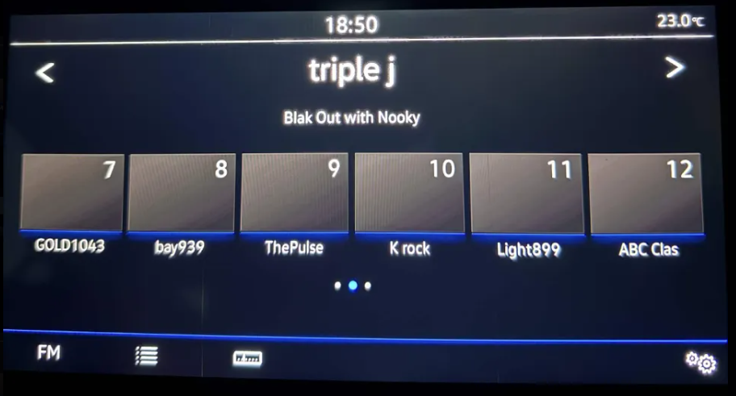
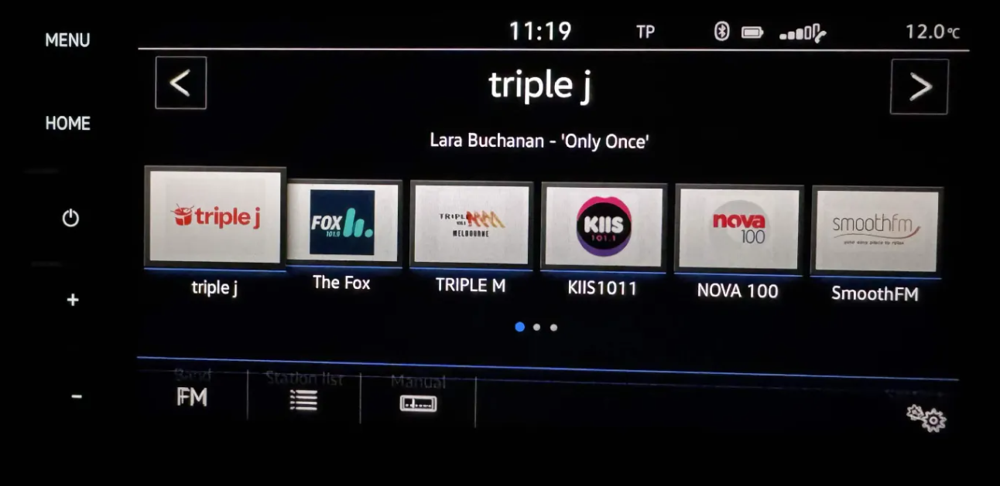
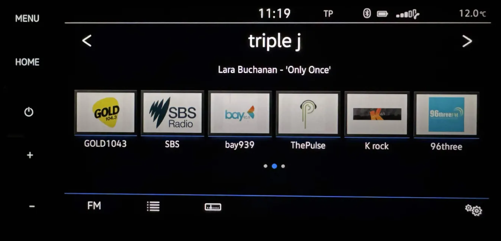

# AU MIB2 Australia RadioStationDB

Updated Australian RadioStationDB (RSDB) for compatible Volkswagen MIB2 / MIB2.5 infotainment systems.

This community project improves Australian FM radio station identification and station-logo matching on compatible MIB units.

The database was created and tested in Australia on a **Volkswagen/Harman MIB2.5 High (Discover Pro)** unit.

**Test unit:** 5NA 035 045 F  
**Hardware:** H55  
**Software:** 1367

---

## 📻 What does this update do?

Some MIB2 / MIB2.5 units using older or European RadioStationDB data may:

- Display no logo for Australian FM stations
- Display incorrect station information
- Fail to match Australian stations with the correct artwork
- Contain outdated Australian station data

This updated RSDB improves matching for Australian stations.

Testing in Victoria showed successful matching for stations including:

- triple j
- The Fox / Fox 101.9
- Triple M
- KIIS 101.1
- Nova 100
- Smooth FM
- Gold 104.3
- SBS
- Light 89.9
- ABC Classic
- PBS 106.7
- 3MBS
- 3RRR

Additional stations may also be recognised depending on your location and the RDS information broadcast by the station.

---

## 📸 Results

### Before

Before installing the updated RadioStationDB, a number of Australian FM stations were missing station artwork or were not correctly matched.

### After

After installing the updated RadioStationDB, the MIB automatically matched many Australian FM stations with their correct station artwork.

The station logos are automatically selected by the MIB based on the station identification data and the RDS/PI information received from the station.

---

## 🧪 Tested System

This release was created and successfully tested on a **Volkswagen Harman MIB2.5 High / Discover Pro** unit in Australia.

The following screenshots show the hardware, software and version information of the exact unit used for testing.

### Tested Unit Information

> **Note:** Successful operation on this unit does not guarantee compatibility with every MIB2 or MIB2.5 variant. Always create a backup of your original RadioStationDB before making changes.

---

## ⚠️ Compatibility

This release is intended principally for compatible **Harman MIB High** systems:

- **MHI2** — MIB2 High
- **MHI2Q** — later MIB2 High / commonly referred to as MIB2.5 High

The database was successfully tested on:

**Volkswagen/Harman MIB2.5 High / Discover Pro**  
**Part number:** 5NA 035 045 F  
**Hardware:** H55  
**Software:** 1367

It has **NOT been tested on every firmware, vehicle, region or head-unit variant**.

### Do NOT assume compatibility based only on the vehicle model.

This package should **not be assumed compatible** with:

- Delphi units
- Technisat/Preh units
- MIB3
- Unrelated infotainment platforms

Different units may use different hardware, firmware, software trains, database formats and regional configurations.

**Always make a backup of your original RadioStationDB before changing anything.**

---

# 💾 Installation

## Requirements

This release is intended for compatible **Harman MIB2 High / MIB2.5 High** units running M.I.B. (More Incredible Bash).

Before continuing you should have:

- A compatible Harman **MHI2 / MHI2Q** unit
- M.I.B. already installed and accessible through the Green Engineering Menu (GEM)
- A known-good FAT32 SD card prepared for M.I.B.
- The M.I.B. SD card inserted into **SD1**
- A backup of your existing RadioStationDB

> ⚠️ This release has been tested on the unit documented above. Do not assume compatibility with Delphi, Technisat/Preh, MIB3 or unrelated infotainment platforms.

---

### 1. BACK UP YOUR ORIGINAL DATABASE FIRST

Before installing anything, create a backup of the RadioStationDB currently installed on your unit using the M.I.B. backup functionality.

**Keep this backup somewhere safe, preferably on your computer as well as another storage device.**

Do not continue unless you have a known-good backup and understand how to restore it.

---

### 2. Download the release

Download the latest release from the **Releases** section of this GitHub repository.

Extract:

`VW_MIB2_Harman_Australia_RSDB_v1.0.0.zip`

The release contains the following database structure:

`mod/RSDB/VW_STL_DB.sqlite`

**Do not rename `VW_STL_DB.sqlite`.**

---

### 3. Copy the database to your M.I.B. SD card

On your computer, open your existing **M.I.B. SD card**.

Copy the supplied:

`mod`

folder to the **ROOT of the M.I.B. SD card**.

The final database location on the SD card must be:

`/mod/RSDB/VW_STL_DB.sqlite`

Keep the supplied directory structure intact.

---

### 4. Install the RadioStationDB

Insert the M.I.B. SD card into **SD1**.

Enter the **Green Engineering Menu (GEM)**.

Navigate to:

`m.i.b. → multimedia_system → radio → radiostation_db → Copy RSDB to unit`

Select **Copy RSDB to unit** and allow the operation to finish completely.

> ⚠️ **Do not remove the SD card or interrupt power while the database is being written.**

---

### 5. Restart the infotainment system

After the database has been successfully copied, restart/reboot the infotainment system.

Allow the system to start normally.

---

### 6. Test the radio

Open:

`Radio → FM`

Allow the tuner and station list to populate.

Refresh or rescan the FM station list if required.

Station logos are matched automatically using information including the station's RDS/PI identification, frequency and regional configuration.

---

## 🇦🇺 Tested Radio Configuration

The Melbourne test installation successfully operated with:

- **FM tuner region:** EU/RDW
- **AM tuner region:** Australia
- **RadioStationDB region:** EU
- **Station-logo region:** Australia / country 61
- **Automatic/Autostore station logos:** Enabled

> **Do not blindly change an otherwise working radio configuration to match these settings.** Different firmware and vehicle configurations may expose these options differently.

---

## 🔄 Recovery

If the database does not work correctly on your unit, restore the **original RadioStationDB backup** you created before installation.

Do not repeatedly install unknown or incompatible RadioStationDB files in an attempt to fix a problem.

This package only supplies a RadioStationDB.

It does **not**:

- Remove Component Protection
- Activate FEC/SWaP features
- Patch firmware
- Unlock protected functions

# 🔧 Troubleshooting

## Station works but has no logo

A missing logo does not necessarily mean the database installation failed.

Matching can depend on:

- RDS station name
- PI code
- Frequency
- Region
- Available station artwork
- Information transmitted by the radio station

Some stations may therefore remain without artwork.

---

## Wrong station logo

Delete the affected preset, tune to the station again and allow the MIB to receive fresh RDS information.

Then save the station again.

If the incorrect match remains, please open a GitHub Issue and include:

- Station name
- Frequency
- City / region
- MIB model
- Firmware train/version
- Screenshot if possible

This information can help improve future versions.

---

## Database does not work on my unit

Restore your original RadioStationDB backup.

Please do not experiment with incompatible databases if you do not have a known-good backup.

---

# 🧪 Help Improve the Database

Reports from other Australian states and cities are welcome.

Testing from users in:

- Melbourne
- Sydney
- Brisbane
- Adelaide
- Perth
- Canberra
- Hobart
- Darwin
- Regional Australia

would be especially useful.

If you test the database, please report:

**Vehicle:**  
**MIB unit:**  
**Part number:**  
**Firmware:**  
**Location:**  
**Stations working:**  
**Stations missing:**  

This will help determine compatibility across different MIB hardware and Australian radio markets.

---

# ⚠️ Important Warning

Modifying infotainment system files always carries some risk.

Use this project **at your own risk**.

Before making any changes:

1. Back up your original RadioStationDB.
2. Make sure you know how to restore it.
3. Do not interrupt power during write operations.
4. Do not install files intended for incompatible hardware.

The project author and contributors are not responsible for damage, loss of functionality, corrupted data or other problems resulting from use of these files.

---

# 🙏 Credits

Thanks to the Volkswagen MIB community and the developers and contributors behind the M.I.B. project and related MIB research/tools.

This Australian RadioStationDB project was created through community experimentation, database analysis and real-world testing on Australian FM radio stations.

---

# ℹ️ Disclaimer

This is an independent community project.

It is **not affiliated with, authorised by, sponsored by or endorsed by Volkswagen AG, Harman International, or any related company**.

Volkswagen, Harman and other product names, logos and trademarks belong to their respective owners.

Radio station names and logos belong to their respective owners.

No ownership of third-party trademarks, artwork or proprietary Volkswagen/Harman material is claimed.

---

## ⭐ Support the Project

If this database works on your MIB system, consider giving the repository a **Star ⭐**.

More testing from different MIB units and different parts of Australia will help improve future releases.
